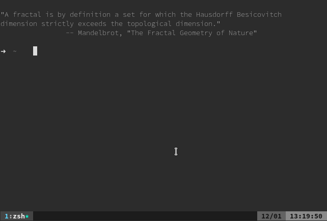

# dotConf
My dot configuration files

## Setup
```sh
sh init.sh
```

Open a new terminal and finish optimization (this is only needed once, hereafter it will happen upon desktop/tty login):
```sh
source ${ZDOTDIR:-${HOME}}/.zlogin
```

```
cd ~/.vim/bundle/YouCompleteMe
git submodule update --init --recursive
./install.py --clang-completer --gocode-completer --tern-completer
```

Open VIM
```
:HelpTags
:GoInstallBinaries
```

## Vim Plugins
* [pathogen.vim](https://tpo.pe/pathogen.vim)
* [ctrlp](https://github.com/ctrlpvim/ctrlp.vim)
* [nerdtree](https://github.com/scrooloose/nerdtree.git)
* [syntastic](https://github.com/scrooloose/syntastic.git)
* [vim-airline](https://github.com/bling/vim-airline)
* [webapi-vim](https://github.com/mattn/webapi-vim)
* [vim-startify](https://github.com/mhinz/vim-startify)
* [vim-sensible](https://github.com/tpope/vim-sensible.git)
* [vim-nerdtree-tabs](https://github.com/jistr/vim-nerdtree-tabs.git)
* [vim-javascript](https://github.com/pangloss/vim-javascript.git)
* [vim-go](https://github.com/fatih/vim-go.git)
* [vim-gitgutter](https://github.com/airblade/vim-gitgutter)
* [vim-fugitive](https://github.com/tpope/vim-fugitive.git)
* [vim-easymotion](https://github.com/easymotion/vim-easymotion)
* [trailertrash](https://github.com/csexton/trailertrash.vim)
* [tmux-complete](https://github.com/wellle/tmux-complete.vim.git)
* [tagbar](https://github.com/majutsushi/tagbar)
* [tabular](https://github.com/godlygeek/tabular.git)
* [phpcomplete](https://github.com/shawncplus/phpcomplete.vim.git)
* [javascript-libraries-syntax](https://github.com/othree/javascript-libraries-syntax.vim)
* [emmet-vim](https://github.com/mattn/emmet-vim.git)
* [YouCompleteMe](https://github.com/Valloric/YouCompleteMe)
* [Polyglot](https://github.com/sheerun/vim-polyglot)
* [tabman](https://github.com/kien/tabman.vim)
* [PIV](https://github.com/spf13/PIV)

## Screenshot

